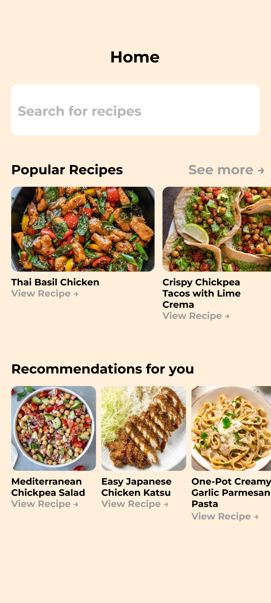
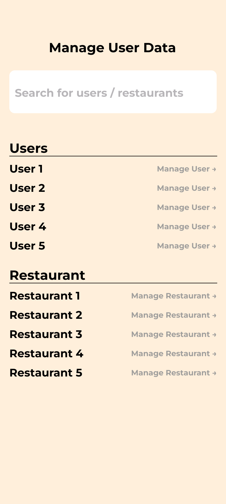
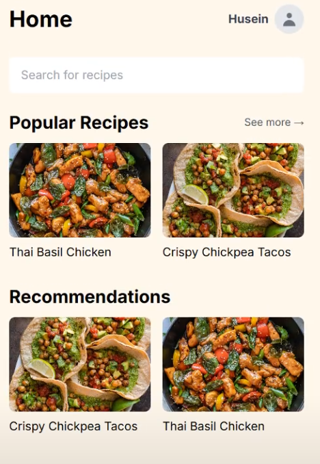

# DeliciousCart

This is a mockup web-based application primarily focused for mobile usage but it can be used in desktop enviroments as well. This application provides the user with recipes where they can buy the ingredients directly from the app. This was developed alongside my teammates as a final project for the Software Engineering (SE) course at our university.

## Key Features

- **Recipe Discovery:** Browse a collection of user-made recipes with instructions.
- **Direct Purchasing:** Select the ingredients you want to buy for a specific recipe to a shopping cart with a simple checkbox.
- **Responsive Design:** A clean interface optimized for both mobile and desktop screens.
- **Role-Based Access:** The application supports different user roles (e.g., Regular User vs. Administrator) with unique views and permissions.

## Tech Stack

- **Backend:** Node.js, Express.js
- **Frontend:** HTML, CSS, JavaScript
- **Database:** MySQL

## Figma Design Prototype

| Regular User View | Restaurant View | Admin View |
| :---------------: | :-------------: | :--------: |
|  |  |  |

## Final Product Video Demo

[(https://youtu.be/VG8ZHl2GESc)]

## Setup & Installation

To get the project running locally, follow these steps:

1. **Clone the repository:**
```bash
git clone https://github.com/MechaOrange1/DeliciousCart.git
```

2. **Install backend dependencies:**
```bash
npm install
```

3. **Set up the database:**
    - Make sure you have a running SQL server.
    - Run the ```sql/database-setup.sql``` script to create the necessary tables.

4. **Set up environment variables:**
    - Copy the ```env.examples``` file to a new file named ```env```.
    - Open the ```env``` file and fill in your database credentials.
    - Don't forget to change the database password in ```server.js```.

## Usage

To start the server, run the following command:
```bash
node server/server.js
```

The application should run at ```http://localhost:3000```.